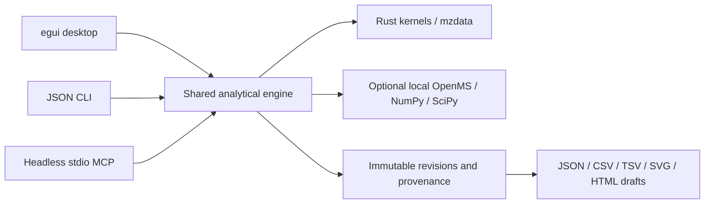

# Chromascope

Chromascope is an AI-native LC-MS workbench with an egui desktop, a JSON CLI, and local MCP interfaces. External clients supply AI reasoning; Chromascope computes and retains analytical evidence through shared kernels.

**Development release preparation, 2026-10-08; final checks continued 2026-10-09.** Cargo version remains `0.3.0`. This checkout includes uncommitted work beyond the published baseline. This is not a published release or instrument-validation claim. See the [feature matrix](docs/FEATURE_STATUS.md), [release notes](docs/RELEASE_NOTES.md), [validation report](docs/VALIDATION_REPORT.md), and [backlog](docs/RELEASE_BACKLOG.md).

## Architecture

One Rust package provides typed `domain` requests, `engine::execute`, bounded `jobs`, append-only `project` revisions and `delivery`. GUI, CLI and headless MCP use shared chromatography, targeted quantification, QC, spectral, annotation and statistics modules. Legacy viewer/desktop MCP paths retain shared parser/processing kernels and GUI presentation state. View commands require the desktop; headless analysis does not.



[Architecture](docs/ARCHITECTURE.md) contains historical design and subsequent implementation contracts. The [roadmap](docs/IMPLEMENTATION_ROADMAP.md) tracks unfinished acceptance gates.

## Installation

The package declares **Rust 1.88** as its minimum; this local pass uses Rust 1.99.0. Build with a compatible Rust toolchain, a platform C/C++ linker/toolchain and the checked-in lockfile:

```sh
cargo build --locked --release --bin chromascope
cargo build --locked --release --no-default-features --bin chromascope-cli
cargo build --locked --release --no-default-features --features mcp-headless --bin chromascope-engine-mcp
cargo build --locked --release --features mcp --bin chromascope-mcp
```

Run executables under `target/release/` (`.exe` on Windows). Default features enable the desktop. Linux GUI builds need platform development libraries; existing CI installs `libxcb-render0-dev libxcb-shape0-dev libxcb-xfixes0-dev libxkbcommon-dev`. See [installation details](docs/USER_GUIDE.md#installation). Local Windows checks do not establish native macOS/Linux or Rust 1.88 compatibility. The validation report distinguishes executed build profiles from these installation commands.

mzML and mzML.gz open directly. Vendor import requires separately installed compatible ProteoWizard `msconvert` and supported vendor runtime/licenses; no universal vendor support is claimed.

| Optional capability | Operator-supplied runtime |
|---|---|
| Untargeted features | pyOpenMS **3.5.0**; select Python with `CHROMASCOPE_OPENMS_PYTHON` |
| Statistics | Python >=3.11, NumPy >=1.26,<3, SciPy >=1.11,<2; `CHROMASCOPE_STATS_PYTHON` |
| Independent reference regeneration | Existing NumPy/SciPy/mpmath environment |

Nothing auto-installs. Missing/incompatible runtimes return explicit errors without numerical fallbacks. Preserve recorded runtime versions for replay.

## GUI workflows

1. Select **Data explorer** and open data with the file controls. Choose TIC/BPC/XIC and acquisition, polarity and mass filters. Retain traces for overlay/grid/stacked comparison. Double-click a trace for its spectrum; right-drag to integrate; middle-drag to box zoom. Integration uses full resolution rather than display decimation.
2. Select **Quantification and QC** for batch methods, peak diagnostics, boundary review and CSV. Expand **Targeted concentrations, calibration and QC** for standards/blanks/QC/unknowns, internal standards, qualifiers, calibration and dilution. Inspect flags and missing states before export.
3. Within targeted quantification, expand **Batch QC and method validation**. Load a study/report or prepare batch evidence, supply explicit rules, evaluate, inspect pass/fail/indeterminate results and acknowledge with reasons. Acknowledgement cannot make a failing rule pass.
4. Select **Identification…** to open **Spectra and compound identification** for native scan inspection/averaging, local MSP/MGF/MassBank import, candidate search/overlays, formula/isotope evidence and reasoned annotations. Similarity alone does not confirm identity.
5. Select **Untargeted analysis…** to open **Untargeted LC-HRMS** with an existing OpenMS runtime and explicit sample roles. Review raw/aligned RT, detected/filled/missing values and blank/QC filters. Retained matrices expose tentative metabolite/lipid hypothesis ledgers.
6. Select **Statistics…** to open the **Statistical analysis workspace** to load a quantitative table or retained feature/targeted response, define groups/preprocessing and inspect PCA, clustered heatmap, volcano and Welch effects/CI/p/q. Earlier original tables/settings remain restorable.
7. Select **Reports…** to open **Project reports and delivery** to inspect a CLI-created project, verify sources, configure a new draft report/bundle and reprocess retained results without replacing them.

The [user guide](docs/USER_GUIDE.md) covers established viewer controls; [examples](examples/README.md) and [project delivery](docs/PROJECT_DELIVERY.md) cover newer workspaces. **AI activity…** shows desktop MCP session activity and launch permissions when connected. Some advanced settings use structured JSON editors. Native dialogs and end-to-end desktop workflows still need platform smoke testing.

## Verified media references

The repository contains [the existing demonstration video](assets/demo.mp4), a historical desktop MCP demonstration. It does not demonstrate all new workspaces. Deleted screenshot/GIF assets are not referenced. Test-generated previews are software-rendered egui fixtures, not native screenshots; no new screenshot or benchmark is asserted here.

Project toolbar **Create project…** / **Open project…** retains workspace snapshots. This recently integrated path remains experimental pending native/recovery acceptance.

## CLI examples

The CLI reads a version-1 request on stdin and returns `{ "ok": true, "result": ... }` or `{ "ok": false, "error": { "code": ..., "message": ... } }` with exit code 1. Progress goes to stderr. Use `-` for embedded-evidence operations. PowerShell, from the repository root after a debug build:

```powershell
'{"version":1,"operation_id":"703ee3bb-3a18-47b1-b51d-dfe001963bfe","actor":"local-analyst","operation":{"operation":"metadata"}}' | target/debug/chromascope-cli.exe run test_file/data_dependent_02.mzML
Get-Content examples/targeted-request.json -Raw | target/debug/chromascope-cli.exe run -
Get-Content examples/qc-request.json -Raw | target/debug/chromascope-cli.exe run -
Get-Content examples/spectral-request.json -Raw | target/debug/chromascope-cli.exe run -
python examples/release_workflows.py --cli target/debug/chromascope-cli.exe --output NEW_OUTPUT_DIRECTORY
```

The targeted starter contains **only an unknown** and cannot establish calibration or valid concentration. QC/spectral starters contain authored demonstration inputs, not instrument-validation data. Supply real standards and justified settings for scientific use. The release helper retains hashes, requests, responses, logs, original/reviewed QC and explicit spectral self-search evidence. [Examples](examples/README.md) also cover full targeted/MCP and statistics workflows.

```powershell
target/debug/chromascope-cli.exe project-create NEW_PROJECT_DIRECTORY
'{"version":1,"operation_id":"703ee3bb-3a18-47b1-b51d-dfe001963bfe","actor":"local-analyst","operation":{"operation":"metadata"}}' | target/debug/chromascope-cli.exe run test_file/data_dependent_02.mzML NEW_PROJECT_DIRECTORY
target/debug/chromascope-cli.exe project-report NEW_PROJECT_DIRECTORY NEW_REPORT_DIRECTORY
target/debug/chromascope-cli.exe project-bundle NEW_PROJECT_DIRECTORY NEW_BUNDLE_DIRECTORY
target/debug/chromascope-cli.exe project-verify NEW_BUNDLE_DIRECTORY
```

`run DATASET PROJECT` registers the source and commits the response. New export paths are required. Bundles are directories containing inventory hashes, historical raw inputs and local software snapshots. Reports are review drafts; see [delivery/replay contracts](docs/PROJECT_DELIVERY.md).

## MCP setup and AI-assisted analysis

Configure a compatible client with an absolute executable and existing authorized data roots:

```json
{
  "mcpServers": {
    "chromascope-analysis": {
      "command": "C:/path/to/chromascope-engine-mcp.exe",
      "args": ["--allow-root", "C:/path/to/data"]
    }
  }
}
```

`analysis_capabilities` supplies generated request/response schemas and recipes. Use `discover_datasets`, `start_analysis`, `analysis_status`, paged `analysis_result`, `cancel_analysis`, `session_audit` and `prepare_analysis_report`. Jobs/audit are session-local; export before shutdown. `commit_analysis` additionally requires `--allow-project-writes`, an existing project/dataset, expected revision, actor and reason. Attributed actors are not authenticated human approvals. See [headless MCP contracts](docs/MCP_ANALYSIS.md).

For visual automation, `chromascope-mcp` hosts the desktop and preserves the original 32-tool bridge. Change/export flags, roots and setup are in the [desktop MCP guide](docs/MCP.md) and [client example](examples/mcp-client.json).

```powershell
python examples/mcp_targeted_workflow.py YOUR_TARGETED_REQUEST.json NEW_AI_DRAFT --server target/debug/chromascope-engine-mcp.exe --qc-rules YOUR_RULES.json
```

Example agent instruction: inspect calibration and QC evidence, identify unresolved results, propose scientifically justified review actions, and prepare a draft retaining original quantities, flags and provenance. No model, hidden thresholds, automatic identity promotion or automatic human approval is built in.

## Analytical capabilities and limitations

Operational slices include chromatographic smoothing/baselines/noise/peak gates and reversible boundaries; weighted linear/quadratic calibration and dilution/qualifier/internal-standard checks; explicit QC study metrics; local spectral matching/formula/isotope evidence; OpenMS detection/affine alignment/correspondence with labelled window gap filling; tentative feature/lipid hypotheses; and local descriptive/two-group statistics. The [complete status matrix](docs/FEATURE_STATUS.md) distinguishes implemented, partial, integrated, experimental and absent capabilities.

No DIA deconvolution, calibrated identity probability/FDR, general specialist lipid-fragment engine, paired/covariate/repeated-measures inference, authenticated approved-only release, PDF/raster report delivery or durable restartable general jobs is provided. Raw mzML source-unit preflight and full-run fallback bounds now have dedicated regression fixtures; comprehensive XML/binary/decompression validation remains open. Other risks include retained evidence/history memory growth, synchronous GUI replay/import, abandoned project locks and unverified OneDrive crash recovery. See [remaining defects](docs/REMAINING_DEFECTS.md) and [backlog](docs/RELEASE_BACKLOG.md). Synthetic/reference tests do not certify instruments or regulatory compliance.

## Reproducibility and development

Raw acquisitions are preserved. Results retain units, parameters, kernel/runtime identities and source hashes. Missing states remain explicit. Project commits append immutable revisions; review reasons and original evidence remain retained. Exact replay has operation-specific limits including generated IDs and external runtimes. Preserve full JSON, source files, lockfile and recorded environment, not CSV alone.

```sh
cargo fmt --all -- --check
cargo clippy --locked --all-targets --all-features -- -D warnings
cargo check --locked --all-features
cargo test --locked --all-features
cargo test --locked --no-default-features --features mcp-headless
cargo build --locked --all-features --bins
python tests/reference/verify_references.py NEW_REFERENCE_DIRECTORY
```

Tests cover kernels, real adapter/protocol/project integration, authored mzML and independent numerical references. Vendor/OpenMS/performance prerequisites are opt-in. Exact executed results and omitted gates are in [VALIDATION_REPORT.md](docs/VALIDATION_REPORT.md). CI now declares a pinned scientific reference runtime and GUI-free/interface checks; platform/MSRV expansion and hosted execution remain open.

Licensed under [GPL-3.0-only](LICENSE). Dependencies include egui/eframe, mzdata, mzsignal, nalgebra and the Rust MCP SDK. Embedded Inter uses the [SIL Open Font License](assets/fonts/inter/LICENSE.txt). Retained MassBank records carry per-record attribution in [spectral_sources.json](tests/reference/spectral_sources.json). See [contributing](.github/CONTRIBUTING.md).
