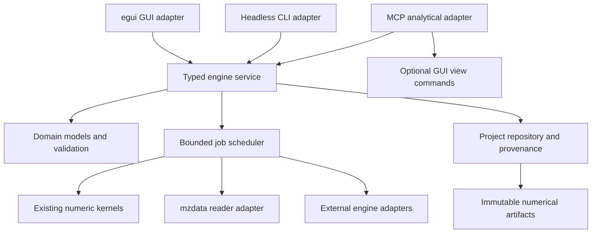

# Chromascope engineering architecture

Audit date: 2026-10-08 (America/Los_Angeles). Baseline commit:
`ff7975aedfdcd894e31dd1e85dc3707d2cdd01f5`, package 0.3.0.
This is an implementation design, not a claim that the proposed work exists.
Execution order, dependencies and status are in [IMPLEMENTATION_ROADMAP.md](IMPLEMENTATION_ROADMAP.md).
Observed validation is in [VALIDATION_REPORT.md](VALIDATION_REPORT.md).


Current-state release audit (2026-10-08): the baseline below is historical.
The working tree now has a shared typed analytical engine, CLI, headless MCP,
advanced analytical GUI workspaces and project delivery. Read FEATURE_STATUS.md
for interface evidence and bounded scopes; later implementation contracts in
this document supersede baseline absence statements. No complete scientific,
platform, bounded-RSS or crash/cloud-sync release certification is implied.
## Historical baseline repository and reusable foundations

Cargo metadata reports one workspace member, the `chromascope` package. There
is no multi-crate workspace declaration. The library exports GUI as well as
parser, processing, validation, import and export modules. The default binary
launches eframe; the optional `chromascope-mcp` binary launches a GUI and stdio
server. There is no analytical CLI or headless MCP runtime.

| Surface | Current implementation and boundary |
|---|---|
| `src/parser.rs` | `MzData` owns `MZReader<File>`, metadata bounds, scan filters, TIC/BPC/XIC and scan access. mzML and mzML.gz are explicit import paths; other formats mentioned in comments are not a validated support matrix. |
| `src/processing.rs` | Shared extraction orchestration, duplicate-RT averaging, moving-average smoothing, display decimation, scan mapping, interpolation and chord-baseline trapezoidal integration. Also contains GUI-routing IDs and color arguments. |
| `src/validation.rs`, `src/error.rs` | Validated XIC construction and bounds, structured core errors. Validation must also be applied at deserialization and public operation boundaries. |
| `src/import.rs` | Direct mzML or external msconvert; argument-vector execution, temporary multi-run output, converter cancellation and logs. Temporary directories are leased through `Arc<TempDir>`. |
| `src/gui/state.rs`, `mod.rs` | Immediate-mode application state, per-file caches and background result routing. `FileId = usize` is stable during an open session, not a durable dataset identity. |
| GUI panels/dialogs/information | Input controls, import settings, metadata and errors. |
| GUI plotting/interactivity/workbench | Trace/spectrum display, linked axes, comparison, scaling, integration gestures and app layout. Keep these as presentation adapters. |
| GUI presets/preset_editor | Version-1 TOML trace definitions and editor, reused by quantification validation. |
| `src/gui/quant.rs` | Private method/analyte/peak/measurement types, local peak detection, batch worker, review states, version-1 JSON batches and CSV. This is the main domain logic extraction seam. |
| `src/gui/workspace.rs` | Retained full-resolution traces, measurements, version-1 JSON viewer sessions, recent files and CSV/SVG exports. Viewer and batch persistence are separate. |
| `src/mcp.rs`, `src/gui/remote.rs` | 32 tools with schema-bearing inputs and a typed command enum, bounded GUI command queue, background open/extract, numeric paging, images, batch review and permissions. Execution depends on egui owner thread. |
| `src/gui/test_render.rs`, tests | Software rendering helper and embedded unit tests; mzML fixture and converter integration tests. Python example exercises stdio and visual workflows but is not run by CI. |

Preserve existing extraction semantics, source scan mapping, full-resolution
integration, method snapshots, automatic versus corrected peaks, ambiguity
diagnostics, local permissions, and independent exploratory measurements.
Do not replace Rust, eframe, mzdata, or the existing numeric algorithms as a
prerequisite. Do not split crates until feature boundaries require it.

Current XIC first collects all matching spectra then uses Rayon. TIC/BPC collect
trace arrays; retained traces, remote results and batch results add copies.
GUI file loading has a queue capacity of 32; MCP has capacity 16, pages at most
10,000 items and batches at most 64 commands. These limits do not bound total
memory or spawned imports. Batch workers use an unbounded result channel and
check cancellation between extractions. Readers are reopened on workers instead
of moved across threads; preserve worker ownership until Send behavior is
established by compilation. Some scan lookups remain on the UI thread.

## Target boundary and incremental extraction



Initially add modules within this package: `domain`, `engine`, `jobs`, `project`
and `adapters`. Move pure types and functions out of GUI with compatibility
wrappers and regression tests. Existing public processing APIs stay callable.
Separate scientific chromatogram kinds from `LineColor` and plotting concerns.
Then feature-gate GUI dependencies so `--no-default-features` can build an
analytical runner. Explicitly preserve today's default desktop build behavior
when introducing a `gui` default feature. MCP headless builds must not import
egui; visual tools can advertise a separate GUI capability. Only later consider
`chromascope-core`, desktop and transport crates if that simplifies maintenance.

The service owns project revisions and dispatch, not mutable widget state.
Workers own readers and emit small immutable artifact references. GUI subscribes
to progress and result events; it never supplies the sole implementation of an
analytical operation. CLI and MCP use precisely the same validation, kernels,
project commits and error codes. View/zoom/theme commands remain GUI-only.

## Identity, units and domain model

Use persisted UUID newtypes (candidate dependency, not added in this audit),
serialized as strings. Names, paths and row offsets are attributes, never keys.
IDs survive save/load, moving files and renaming entities. Imports allocate
identities once, record the mapping and write it transactionally. Content hashes
deduplicate bytes but do not conflate sample identities.

| Entity | Identity and essential relations |
|---|---|
| Project | `ProjectId`, schema version and monotonically increasing revision. |
| Dataset | `DatasetId` for an acquisition run; source artifact hashes, native run identity, reader metadata, acquisition and immutable import record. Multi-run vendor input creates separate datasets linked to one source. |
| Sample | `SampleId` for biological/material metadata; injection records link samples to datasets, allowing reinjections, blanks, standards and pooled QC. |
| Analyte | `AnalyteId`; names, formula/adduct/charge and transitions are versioned attributes. Multiple RT targets may share mass. |
| Method | `MethodId` plus immutable `MethodRevisionId`; extraction, detection, integration, calibration and QC configuration. Editing produces a revision. |
| Peak | `PeakId` for an observed candidate in dataset/analyte or feature context; immutable boundary revisions preserve automatic and manual history. |
| Result | `ResultId` plus revision, dataset/sample/analyte/method/peak references, typed quantities, uncertainty, flags and lineage. |
| Feature | `FeatureId` plus grouping/alignment revision, for untargeted signals distinct from confirmed analytes. |
| Other | `ArtifactId`, `OperationId`, `JobId`, `ReviewId`, `IdentificationId`, `CalibrationId` and stable injection IDs. |

Scan reference is `(DatasetId, native_scan_id, original_index)`, preserving both
native identity and existing index behavior. Newtypes distinguish minutes,
seconds, m/z, ppm, Da, intensity and concentration. Preserve existing RT minutes
and intensity*minutes area; conversions are explicit at boundaries. Keep f32
source values visible in provenance; f64 conversion cannot recover lost precision.
Validate finite values, sorted RT/mass arrays, aligned vector lengths, range
containment, enums and referential integrity before kernel execution. Treat
missing, zero, failed, censored and not-applicable results separately.

## Typed operations and concurrency contract

Define a versioned request envelope with operation ID, actor, project ID,
expected project revision, optional idempotency key and typed parameters.
Queries return immutable snapshots. Mutations return artifact/result references
and a committed revision; expensive operations return a JobId immediately.
Canonicalize parameters for hashing independently of TOML formatting.

Initial analytical operations: import/register source, inspect dataset/scan,
extract chromatogram, integrate interval, validate/revise method, quantify batch,
list/page artifacts, propose result revision, accept/reject review and export.
Later operations: calibrate, evaluate QC, identify spectrum, detect/group/align
features, normalize, compute statistics and generate reports. No arbitrary code
execution or opaque model-generated scripts enter the engine API.

`Result<T, EngineError>` uses stable codes including invalid_parameters,
missing_source, stale_revision, unauthorized, unsupported_capability,
resource_limit, cancelled, adapter_failure and corrupt_project. Transport JSON
comes from domain DTOs rather than `serde_json::Value` inside numerical kernels.
Idempotency keys bind canonical request hashes: retries reuse the prior job or
result; reusing a key for different input is rejected. Numeric page cursors bind
artifact revision, preventing inconsistent pages during edits.

Use optimistic revision checks for commits and review. A stale worker completion
cannot overwrite a newer manual boundary, method edit, changed selection or
closed dataset. Computation may finish into an immutable artifact, but applying
it requires a valid revision or explicit rebase. Multi-operation MCP batches
currently run sequentially with per-command outcomes; retain that documented
behavior rather than silently promising atomicity.

## Versioned projects and provenance

Proposed project directory: a manifest identifying schema and project, a SQLite
metadata/event database, immutable blobs keyed by SHA-256, and optional source
copies. SQLite is a future dependency decision with Windows/OneDrive locking
tests before adoption. Do not put all chromatograms and spectra into JSON rows.
Store chunked binary arrays with schema, dtype, units, row count and hash;
choose columnar tooling only when matrices/export need it.

Manifest/database revision is authoritative. Write blobs to temporary files,
flush and rename on the same filesystem, then transactionally reference them.
Orphan cleanup only removes unreferenced verified artifacts. Single-writer
locking and crash recovery are mandatory; network/cloud-sync directories need
explicit testing before being advertised. Backup includes the database snapshot,
manifest and referenced blobs. Raw files remain immutable.

Projects distinguish reference-only and self-contained source policies. Re-link
missing files by verified content identity; never silently trust a same-named
replacement. Hash vendor directories via a deterministic relative-path manifest.
Persist converted runs or their reproducible import recipe before temporary
leases disappear. Conversion provenance records converter version, executable
identity, args, source hashes, output hashes and logs.

Support read-only import of existing viewer sessions, batch JSON and TOML
methods/presets. Preserve original files and raw values, assign IDs once and
retain legacy-to-new mapping. Unknown future schemas fail with a useful error;
migrations are explicit, backed up, restart-safe and tested against fixtures.
Keep legacy save/export until migration equivalence is verified.

Provenance is an append-only DAG: input artifact hashes, typed operation and
canonical parameters, kernel/version/build identity, method revision, adapter
and library/database versions, units, start/end UTC timestamps, actor (human,
AI client or automation), job state, warnings, random seed and output hashes.
Record cancellation/failure as well as success. AI rationale and client/model
identity are supplied metadata, not proof of scientific validity. Store review
events separately from numeric computation. Export bundles include machine
readable lineage and checksums. Local provenance is auditable history, not a
claim of tamper-proof or regulatory-certified storage.

## Cancellable bounded-memory execution

Job states: queued, running, cancelling, cancelled, succeeded, failed, interrupted.
Terminal transitions happen once. Persist checkpoints only at validated chunk
boundaries; restart marks unfinished jobs interrupted rather than succeeded.
Cancellation retains completed outputs with explicit partial-batch status.

Limit worker count, concurrent readers, in-flight decoded bytes, queue depth,
retained cache bytes, disk usage and transport response size. Budget admission
uses estimated peak memory with a conservative fallback; oversized individual
spectra are rejected or processed through a documented spill strategy. Read
spectra in bounded chunks, process on a fixed Rayon pool, merge deterministically
and spill full traces/matrices to disk. Do not collect a run of spectra first.
Sharing a reader across workers is unnecessary; per-worker ownership remains.
Extraction of multiple analytes should traverse a scan once when equivalent to
legacy separate XICs. Numerical output size can grow with input; bounded RAM
therefore requires disk-backed artifacts, not merely bounded channels.

Check cancellation between chunks, decoding steps where supported, and adapter
polls. Blocking vendor/adapter processes use deadlines, termination and cleanup;
on Windows test descendant-process handling. Define a measured cancellation
target (initially <=2 seconds outside a non-interruptible decode call), report
that exception and avoid claiming immediate cancellation. Cache keys include
source hash, operation parameters, method/kernel version and units. Cache
eviction removes recomputable artifacts without dropping committed results.

## Analytical modules and review

Targeted quantification extends existing unsmoothed XIC detection and chord
integration first. Preserve moving-average detection and nearest expected-RT
selection as named versioned algorithms. Add transition qualifiers/ion ratios,
internal-standard pairing, calibration standards, weighted fit selection,
residuals/back-calculated accuracy, dilution and concentration units, validated
range and explicit LOD/LOQ policies. Never turn integrated area into concentration
without a valid calibration model. More baseline/deconvolution choices require
independent reference validation, not silent changes to existing methods.

QC associates sample roles, injection order and batch metadata with rules for
blank contamination, carryover, missingness, mass/RT drift, internal-standard
response, pooled-QC CV and calibration accuracy. Report thresholds and evidence
per flag; automatic flags do not silently exclude observations. QC gates feed
review and report completeness.

MS/MS identification stores spectrum preprocessing, precursor/charge/adduct,
fragment tolerances, collision metadata, library release/hash and license,
score components, ranked alternatives and evidence level. Begin with explicit
library matching on supported DDA spectra; DIA deconvolution, proteomics search
and FDR are separate capabilities with separate validation. A mass match or
high similarity alone never becomes a confirmed identity. Keep absent evidence
and unresolved alternatives visible.

Untargeted analysis stages centroiding (where required), chromatographic feature
detection, isotope/adduct grouping, RT alignment, cross-sample correspondence,
gap filling, blank/QC filtering and feature matrix construction. Preserve raw
versus aligned RT and each transformation's parameters. Gap-filled values are
labeled separately. Do not assume SRM/MRM data support full-scan discovery.

Statistics consumes a frozen matrix plus sample design: transformation,
normalization, missingness/imputation policy, scaling, PCA, group models,
effect sizes, intervals and multiple-testing correction. Preserve exclusions,
covariates and seeds; prevent label leakage in predictive validation. Start with
well-defined descriptive/univariate methods; advanced models may use adapters.

Reports consume immutable project revisions and include methods, calibrations,
QC failures, identification uncertainty, review history, units and provenance.
Preserve existing CSV/SVG, then add table/matrix and HTML report bundles;
PDF is optional after layout verification. Export unresolved and partial data
with flags; any approved-only report checks explicit review requirements.

External engines implement a capability/version handshake, typed request and
result schema, source and output hashes, bounded resources, timeout/cancellation,
logs and deterministic import validation. msconvert is the first existing
adapter. Potential later engines for feature detection, spectral matching and
statistics are candidates, not dependencies approved or installed here. Use
argument vectors and isolated work directories; never shell-interpolate inputs.
Validate licenses, availability and schema mappings before selection. Data
leaves the local machine only under an explicitly configured remote adapter.

AI clients query evidence, propose operations and explain alternatives. A
proposal references the exact result/method revision and affected entities;
accept/reject creates a ReviewId with actor, reason and before/after references.
Humans can undo through a new revision rather than erasing history. Keep current
MCP read/change/export controls; project policy can require human acceptance
for boundary edits, identifications, exclusions or final release. Engine policy
enforces review independently of GUI and transport. AI output is an attributed
proposal until accepted under policy. No embedded LLM is required for an
AI-native analytical engine.

## Dependency and build policy

Current direct dependencies: serde/serde_json/TOML for persistence; egui/eframe
0.33.3 with glow, X11 and Wayland; egui_plot 0.34.1; mzdata 0.63; Rayon;
libz-sys; thiserror; rfd; image PNG; log/env_logger; tempfile. Optional MCP uses
rmcp 3.5.1, Tokio and base64. `approx` is the dev dependency. Cargo.lock fixes
actual resolution; do not upgrade these merely to execute the plan.

Proposed additions by necessity: UUID newtypes and SHA-256 in identity/provenance;
SQLite after project storage evaluation; CLI parsing after engine extraction;
columnar/numerical dependencies only for validated advanced modules. Each
addition needs license/MSRV/platform/feature review and a measured benefit.
Reuse std channels/atomics and Rayon initially; Tokio should not become a
requirement for synchronous numerical kernels.

The manifest declares Rust 1.88, but this audit runs 1.99.0. Add actual 1.88
checks before advertising verified MSRV compatibility. Linux CI currently checks
format, all-feature Clippy and tests; release uploads desktop only across Linux,
macOS and Windows. Add OS/default/headless/MCP matrices incrementally. Release
uses size optimization, LTO, one codegen unit and panic=abort: benchmark numerical
throughput and crash behavior before changing profile defaults. A wasm rustflag
and web assets are not proof of a supported web analytical workbench.

## Implemented foundation update — 2026-10-08

The audit descriptions above record the original baseline. The current checkout now
adds `domain`, `engine`, `jobs`, `project`, `presets`, `quant` and optional
`engine_mcp` modules. Pure legacy method/preset validation, peak detection and
measurement live outside GUI. GUI wrappers and the existing 32-tool desktop MCP
continue to call these shared functions and `processing`; numerical semantics
remain legacy-v1. `engine::execute` validates typed requests and returns serializable
metadata, spectra with native scan metadata, full-resolution chromatograms,
chord areas or targeted measurements. Response provenance includes request/actor,
operation/result UUIDs, kernel version, timestamps and source SHA-256. RT is minutes,
area is instrument intensity * minute, and intensity remains instrument-specific.
The new scalar wrappers cover RT and area; comprehensive m/z/ppm/concentration
newtypes and durable analyte/peak/review identities remain to be implemented.

Default builds enable `gui`; `--no-default-features` omits egui/eframe/rfd/image.
`mcp` retains the desktop transport. Independent `mcp-headless` enables the
`chromascope-engine-mcp` console runner and its `analytical_operation` tool,
using the same request envelope as the CLI. Canonical source paths must be inside
explicit launch-time roots. This runner performs no writes and exposes no GUI
tools. Existing desktop MCP schema/policies remain unchanged.

Storage spike decision: use append-only version-1 JSON project snapshots and
content-addressed JSON analytical artifacts for this first slice, avoiding a new
SQLite locking dependency before OneDrive/OS recovery testing. Each commit holds
a create-new writer lock, checks project ID/expected revision, writes a synced
temporary file and publishes without overwriting. Reopen verifies referenced
artifact hashes and identities; raw sources are references with SHA-256/byte size,
verified before use. Relinking requires identical content. Existing revisions
retain original methods/results and allow historical recovery. TOML version-1
method import validates data, leaves the original untouched, and reuses the same
MethodId for repeated imports of identical bytes. Unknown schemas are rejected.
Failed CLI computations against a project record the request/error in a new revision.

This is not the full proposed storage system: numerical JSON is input-sized,
large binary/chunked artifacts, database migration, automatic orphan cleanup,
backups/restore API, viewer/batch migrations and project GUI controls remain open.
A process crash may leave `writer.lock`; automatic stale-lock removal is deliberately
absent. Interrupted temporary files never become committed revision names. Network
and cloud-sync durability, directory fsync and adversarial filesystem races are
not certified. Existing legacy viewer/batch save behavior remains available.

The scheduler admits 1–16 worker-owned readers with a 1–256-job bounded queue,
terminal status, cancellation tokens and scan progress. Default limits: 2,000,000
scans and 50,000,000,000 source bytes per operation; requests/MCP results cap at
16 MiB. XIC streams one spectrum at a time, retaining only trace values. Cancel
checks occur in hashing, metadata traversal and extraction iterations; decoding
and reader open can block. These limits are admission limits, not a proven total
RSS ceiling. Disk spill, decoded-spectrum byte budgets, durable jobs/checkpoints,
idempotency and revision-aware automatic worker commits are deferred. Debug
panic isolation does not override the existing release panic=abort setting.

### Headless commands

Build with `cargo build --locked --no-default-features --bin chromascope-cli`.
`chromascope-cli run DATASET [PROJECT_DIRECTORY]` reads a request JSON from stdin
and writes one `{ok,result}` or `{ok:false,error}` JSON object to stdout. Errors
exit 1; successful operations exit 0. A project argument commits the response
against the observed revision. A minimal metadata request is:

```json
{"version":1,"operation_id":"00000000-0000-4000-8000-000000000001","actor":"local-user","operation":{"operation":"metadata"}}
```

Other operation tags: `spectrum` with `index`; `extract` with the existing
serialized `ProcessingParams`; `integrate` with `points`, `start`, `end` (minutes);
`quantify` with the validated legacy method object. Use a fresh operation UUID for
each new request. Source-less integration uses the supplied trace as its evidence.
`project-create DIRECTORY` requires a new directory; `project-inspect DIRECTORY`
verifies/reopens an existing project; `project-restore DIRECTORY REVISION` restores
historical content as a new revision without rewriting history; `project-import-method DIRECTORY METHOD.toml`
adds a validated legacy method. Data sources must remain accessible for new analysis.

Build MCP with `cargo build --locked --no-default-features --features mcp-headless
--bin chromascope-engine-mcp`, then launch `chromascope-engine-mcp --allow-root
DIRECTORY`. Its tool arguments are `{path,request}`. Large results explicitly fail
with resource_limit; paging/job control tools remain future work.

Dependencies added: UUID (existing locked 1.27.0, v4/serde, MIT OR Apache-2.0)
and SHA-256 (sha2 0.10.9, MIT OR Apache-2.0). Both are Rust libraries; no external
scientific package or analytical algorithm has been substituted. serde_json's
float_roundtrip feature preserves exact f64 JSON re-parsing. Windows current
compiler builds validate compatibility here; declared Rust 1.88 is not yet tested.

## Advanced chromatographic processing delivery - 2026-10-08

`src/chromatography.rs` adds the versioned `chromatography-v1` kernel without
changing legacy smoothing/detection/chord integration. The GUI review adapter,
CLI and headless MCP all call this module. No dependency or lockfile change was
needed for this delivery: local reorthogonalized QR and a linear-memory banded
Cholesky solver implement the explicitly stated equations, with independent
NumPy/SciPy numerical fixtures rather than an unvalidated runtime bridge.

Signal artifacts retain supplied raw samples (including null missing intensity),
RT minutes, smoothed intensity, estimated baseline, corrected raw intensity,
corrected smoothed intensity, and the exact signed integration signal. Individual
peak areas are trapezoids in instrument intensity * minute. Baselines are none,
endpoint chord, RT-aware asymmetric least squares, or rolling lower quantile with
local averaging. AsLS uses W + lambda D' D and updates positive-peak asymmetric
weights; the irregular-grid second differences are normalized by median spacing.
On uniform RT it agrees with the independent SciPy sparse second-difference
reference. This generalization is explicitly a versioned model, not a claim of
identical irregular-grid behavior to index-based AsLS packages.

SG windows are odd, 3..501 samples, degree 0..5 below window length. Full windows
shift at edges and evaluate a polynomial at actual RT; no zero or reflected
padding is used. On uniform sampling this follows [SciPy interp edge handling](https://docs.scipy.org/doc/scipy/reference/generated/scipy.signal.savgol_filter.html).
The generalized irregular-grid implementation is tested against independent
NumPy least squares, including both edges. Near-singular sample geometries fail
with a structured error. Segments shorter than the requested window explicitly
warn and bypass smoothing. Missing samples or configured acquisition gaps split
segments; no smoothing, baseline or integration bridges them.

Noise is a robust MAD estimate of RT-weighted neighbor interpolation residuals,
normalized by the independent-noise variance and Gaussian MAD factor. It assumes
approximately independent Gaussian noise and locally smooth signal; correlated
noise, coarse peaks and very short segments can bias or prevent estimation.
Zero MAD produces unavailable SNR, not infinite SNR. Detection requires positive
height, minimum height, prominence and height/prominence SNR thresholds. Maxima
and plateau midpoints are discrete scan apices; FWHM uses interpolated crossings
of half corrected height, in minutes. A clipped half-height width is null with a
flag, never substituted with boundary width. Bounds follow a configured fraction
of corrected height or a local minimum/trace edge. Resolved overlapping maxima
are partitioned at their valley, conserving the observed interval area without
double counting. Such areas are not Gaussian/EMG component deconvolution. An
unresolved mixture can remain one peak; every analysis states this limitation.
Negative intensities are retained and integration is signed, with no positivity
clamp. Width gates reject unknown widths when a restrictive width gate applies.
AsLS is a literature-based alternative baseline; see the
[chromatographic evaluation](https://pubmed.ncbi.nlm.nih.gov/23453461/).

An analysis contains immutable automatic peaks plus append-only correction
revisions (actor, reason, operation, full peak list and explicit review state).
Manual intervals use interpolated endpoints; reference-assisted integration
transfers supplied intervals with an explicit RT shift in minutes. It does not
infer reference identity or align a run. Restore can target automatic revision
zero or any earlier revision, adding history rather than deleting it. Accept is
an explicit revision. Supplied analyses are numerically replayed before review,
restore or export, detecting changed signals, peaks or history. Revision checks
reject stale proposals. Preview returns a proposed copy separately labeled by
the engine; GUI requires Apply, and project persistence rejects preview results.
CLI previews do not register sources, record failures or commit project revisions.

`Operation::ProcessChromatograms` accepts 1..64 input traces, at most one million
samples total. `ReviseChromatogram` carries analysis, expected_revision,
correction and preview. `ExportChromatographicPeaks` returns verified CSV text
without filesystem writes, including through MCP. All use request version 1.
Configuration fields default to `Config::default()` when omitted, while unknown
fields and invalid parameters are rejected. Raw numeric inputs are caller-
supplied: a supplied dataset path does not prove they were extracted from it.
Request/result artifacts preserve those inputs; original acquisition sources
remain separately immutable and checksum-verified by project storage.

### Using the delivered workflow

In the GUI, run the existing quantification batch, select a result and open
Advanced chromatographic processing. Configure processing, Preview processing,
inspect the four plotted stages and peak table, then Apply advanced preview.
Process unprocessed batch traces computes all proposals before applying any,
retaining already processed rows. Use legacy start/end controls to set manual
bounds; enter a reason, Preview manual bounds and Apply. Copy reference bounds
from another processed row, select a target, enter an explicit RT shift and
Preview reference bounds. Preview accept, Preview undo or Preview restore
automatic all require Apply. Save the existing .chromquant batch to retain raw
traces, all stages and every advanced revision; old batches still deserialize.
Saved processing configuration is immutable and displayed from the saved
analysis, rather than from another row's draft controls. Reruns preserve saved
advanced results; method changes refuse to overwrite them. Advanced CSV export
uses create-new and includes sample/analyte labels. Full history is in batch JSON,
not in the flat current-peak CSV.

PowerShell example (synthetic Gaussian input, not hardcoded output):

```powershell
Get-Content examples/chromatography-request.json -Raw | cargo run --locked --no-default-features --bin chromascope-cli -- run -
```

Save that JSON response to a new file for provenance. Pipe it to
`chromascope-cli export-peaks NEW_PATH.csv` for a lossless current-peak table;
existing output paths fail without replacement. Submit the same typed request
to headless MCP `analytical_operation`, with an existing path under a launch-time
allowed root; the root policy is still enforced for numeric-only requests.
A correction operation has this inner operation shape (analysis is the returned
analysis object, not an opaque filename):

```json
{"operation":"revise_chromatogram","analysis":{},"expected_revision":0,"correction":{"kind":"manual","intervals":[[2.1,3.9]],"reason":"Checked standard bounds"},"preview":true}
```

Replace the empty analysis example with the actual object. Resubmit with
preview=false and the same original expected revision to commit a correction.
Use correction kind reference with intervals/shift_minutes/reason; restore with
revision/reason; accept with reason. `export_chromatographic_peaks` accepts
analyses and returns CSV text. JSON responses retain stages, configuration,
algorithm version and correction history. CSV carries units, boundaries, apex,
height, prominence, nullable FWHM/SNR, flags, revision and review state.

Remaining limitations: advanced GUI processing currently runs synchronously;
very large traces can delay frames, and cancellation is checked between engine
traces rather than inside polynomial/baseline/detection loops. Trace/transport
limits do not establish bounded process RSS. Gaussian/EMG fitting, unresolved
component deconvolution, automatic reference alignment, durable review UUIDs/
timestamps and parameter-change revisions are deferred. Native OS interactions,
large-run latency, MSRV/other platforms and real instrument reference panels are
not certified by synthetic and software-render tests.


## Targeted concentrations delivery - 2026-10-08

The new `src/targeted.rs` is the shared targeted small-molecule analytical kernel.
`Operation::TargetedBatch`, `ReviewTargeted`, and `ExportTargeted` call it through
`src/engine.rs`; the existing CLI `run` JSON envelope and headless MCP
`analytical_operation` accept these same operations. The desktop quantification
workspace adds `src/gui/targeted.rs` as an independent panel. Existing area-only
methods, batch files, advanced chromatography, CLI and desktop MCP remain callable.

A version-1 batch request holds stable caller-defined sample/target IDs, sample
source paths, standard/blank/QC/unknown roles, unique injection order, positive
dilution factors, nominal injected concentrations and reasoned exclusions.
Target definitions retain quantifier and qualifier extraction specifications
(m/z, ppm, acquisition, polarity, MS level and supported precursor filters), RT
windows/expected RT in minutes, qualifier area-ratio bounds and coelution tolerance
in minutes. Internal standards are separate target IDs with strictly positive
area acceptance bounds, without chained IS dependencies. Each calibrated target
states its concentration unit (`ng_ml`, `ug_ml`, `mg_l`, `nmol_l`, `umol_l`).
Nominal values and range/LOD/LOQ all use that unit; no mass/molar conversion or
molecular-weight inference occurs. Dilution multiplies the injected concentration
only when reporting sample concentration. Standard/QC accuracy and precision are
computed on injected concentrations, so differing dilutions do not distort QC.

Raw acquisitions pass through the existing unsmoothed XIC/peak engine, preserving
its moving-average detection, discrete boundary selection, ambiguity and signed
chord-trapezoidal area semantics. Quantifier/qualifier measurements, traces,
automatic versus selected peaks, parameters, source SHA-256 hashes and batch
configuration remain in the result. Sources are hashed before extraction and
checked again after each sample; input changes fail structurally. Sample sources
are read-only. The batch reopens a reader per sample/target; it does not yet fuse
multiple XIC extractions into one scan traversal.

Calibration minimizes sum(w*(response - polynomial(concentration))^2).
Polynomial degrees 1/2/3 and free/zero/fixed intercepts are explicit options.
Weights are 1, 1/x or 1/x² using nominal injected concentration; zero weighted
standards require an explicit reasoned exclusion, never an epsilon replacement.
The independent variable is scaled by maximum standard concentration. nalgebra
0.33.3 SVD solves the weighted design matrix, with relative rank cutoff 1e-12;
rank deficiency is an error and condition above 1e8 is flagged. This follows the
library's [documented decomposition API](https://www.nalgebra.rs/docs/user_guide/decompositions_and_lapack/).
Coefficients are in powers of concentration/scale, not raw concentration powers.
More observations than fitted parameters and at least degree+1 distinct levels
are required. The declared range must be covered by included standard levels.
A missing/ambiguous/failed included standard invalidates that target's fit; flags
never silently exclude a standard or select a different model.

Diagnostics include residuals, weights, back-calculated accuracy (100*predicted /
nominal), residual degrees of freedom, unweighted centered R², weighted RMSE
sqrt(sum(w*r²)/sum(w)), and residual standard error sqrt(sum(w*r²)/(n-p)).
R² is null for constant responses. Accuracy is null for zero nominal levels.
Standard/QC replicate groups retain total and usable counts, sample SD (n-1),
CV=100*SD/abs(mean), and explicit missing/insufficient/incomplete-group flags.
Configured accuracy/CV and blank-response thresholds are saved in the request.
These are review diagnostics, not an automatically certified regulatory protocol.

Inverse prediction partitions the validated domain at polynomial derivative roots
and bisects each monotonic interval. All distinct in-range roots are considered:
multiple roots yield `ambiguous_root`; none yield an explicit range/failed state.
The model stores its own range and rejects callers that extend it. Nonmonotonic
and cubic models are flagged. There is no concentration extrapolation or negative
response clamp. Only floating-point boundary roundoff within 64*f64::EPSILON of
the response scale is tolerated; returned boundary estimates are explicitly
flagged `boundary_roundoff`, and meaningful out-of-range responses still fail.
LOD/LOQ classification uses an available in-range injected estimate; below-domain
signals are `below_range`, without inventing an extrapolated LOD estimate.

Results distinguish present, missing, rejected, below_detection, below_loq,
below_range, above_range, failed and ambiguous. Censored/out-of-range/failed rows
have no reportable concentration; in-range censored estimates stay separately
in `injected_concentration`. Signed measured areas and responses remain intact.
Zero/negative or unusable IS responses prevent division and carry explicit flags.
Qualifier missingness, ratios, coelution and IS area bounds are reported with the
underlying measurements. Blank rows report response/contamination evidence,
never a sample concentration.

Batch artifacts carry schema, UUID, kernel version and creation timestamp.
Review events append UUID, timestamp, actor, reason, sample/target and decision;
revision checks reject stale changes. Reject then accept restores the original
numeric result without erasing either decision. Unavailable concentrations cannot
be accepted. Original concentration fields remain in rejected JSON evidence, but
CSV omits reportable rejected values. Review never silently refits or excludes
calibrators/QCs. Replay revalidates traces, selected areas, ion filters, RT bounds,
fits, concentrations, precision and review decisions before restore/review/export.
This detects inconsistent artifacts; it is not a signature proving authenticity
of externally supplied measurement evidence. Full JSON holds provenance and all
numeric inputs; concentration CSV and calibration/residual CSV are separate tables.
All new GUI/CLI file writers use create-new and refuse existing paths.

### Interfaces and practical workflow

In Batch Quantification, select runs and open **Targeted concentrations,
calibration and QC**. Configure from selection, assign roles/levels/dilutions in
Sample sheet, and edit ions/calibration in Calibration and analyte settings.
The JSON editor exposes full definitions, IS-only targets (`calibration: null`),
additional qualifiers and reasoned exclusions. Defaults are editable scaffolding,
not validated assay thresholds. Run targeted quantification uses a cancellable
background worker; results retain the exact submitted request even if a draft
changes. Select a row, inspect ion traces, fit/residual plots and standards, then
enter a reason and accept/reject. Save targeted history saves all runs/reviews;
its run selector allows inspecting earlier runs. Load replays every saved batch.
This history format is separate from legacy `.chromquant` files.

`examples/targeted-request.json` is an editable request using the existing mzML
fixture, explicitly without known standard concentrations. It exercises raw
extraction and reports a failed calibration until real standards are provided;
it is not a scientific reference panel. Use absolute sample paths for MCP.

```powershell
Get-Content examples/targeted-request.json -Raw | cargo run --locked --no-default-features --bin chromascope-cli -- run -
# Pipe a real run response (including its full batch) to a new CSV path:
Get-Content saved-response.json -Raw | target/debug/chromascope-cli export-targeted concentrations-new.csv
Get-Content saved-response.json -Raw | target/debug/chromascope-cli export-targeted-calibration calibration-new.csv
```

For project persistence, `run - PROJECT` registers every batch source and commits
an immutable response artifact anchored to the first source. Project commits
verify all batch hashes against registered current sources. Prior project
revisions/results remain available. MCP verifies every nested sample path against
launch-time roots, then uses the existing bounded scheduler. Review/export operate
on the supplied batch without rereading raw acquisitions; project commits perform
source verification separately. MCP returns CSV text, without filesystem writes.
The review operation includes `batch`, `expected_revision` (review count), `sample`,
`target`, `accepted`, `reason`, and the envelope actor. `export_targeted` returns
both concentration `csv` and `calibration_csv`.

Limits: 256 samples, 64 targets, 8 qualifiers per target, two million retained
ion points; existing source/scan and transport budgets apply. Point caps do not
prove bounded RSS, and a single extraction allocates before the batch cap is
checked. Cancellation retains previous completed GUI runs; a cancelled/failed
new acquisition batch returns a structured error without committing partial
results. There is no durable partial-batch resume. CSV sample sheets and dedicated
qualifier-add/remove controls are not implemented; complete definitions are
available through JSON. Direct targeted manual boundary revisions are not yet
exposed; change RT/method definitions and run a new retained batch, while the
existing independent area/advanced peak-review workflow remains available.
Automatic LOD/LOQ estimation, carryover studies, uncertainty intervals, robust
outlier/model selection, assay acceptance policies and real-instrument reference
panels are outside this delivered slice. GUI restore and detailed replay may
still pause large frames; repeated readers/hashes and JSON retention need the
foundation's streaming, binary-artifact and durable job work. Native dialogs,
MSRV/other platforms, real instrument panels and OneDrive recovery are unverified.

## Batch QC and method-validation delivery - 2026-10-08

`src/qc.rs` is the shared analytical module. Domain/engine operations are
`evaluate_qc {study}`, `evaluate_targeted_qc {batch,rules}`,
`validate_method {study}`, `review_qc {report,expected_revision,rule_id,reason,acknowledged}`
and `export_qc {report}`. CLI `run -` accepts the same request; `export-qc NEW.csv`
consumes a saved engine response and refuses existing files. Headless MCP exposes
these through `analytical_operation`; its path argument must name an existing
file within an allowed root, even for observation-only operations. No arbitrary
code or remote scientific service is invoked. Existing GUI/CLI/MCP/mzML paths,
legacy algorithms, raw files and prior results remain intact.

### Evidence, acceptance and study design

Version-1 Study declares method and purpose (`batch_qc` or `method_validation`),
observations and rules. Each observation has unique ID, target, batch, group,
role, injection order, value/concentration unit, response unit, nullable measured
value/nominal/response/IS area/RT/expected RT/mass error/standard acceptance,
preparation and source record. Injection orders are unique per batch/target.
All numbers must be finite; missing values are null, never silently zero.
Generic studies must include the expected observation grid (including missing
rows); the engine cannot infer unsubmitted injections. External mass errors are
explicit ppm observations; the current targeted extraction does not produce
centroid mass errors and the adapter leaves them null.

A rule declares ID, target, optional group/role/batch filters, metric, inclusive
lower/upper bounds, minimum_n, required, optional reference_group and optional
calibration configuration. No framework is universal or selected automatically.
GUI configuration copies only accuracy/CV/blank limits already saved in the
retained targeted assay. Additional carryover, drift, calibration performance,
control and study rules require explicit method-specific values. LLOQ-specific
limits can use separate `level:<nominal>` groups. Exclusions and failed results
are not silently removed from QC; the targeted snapshot retains their reasons.

Each decision retains the exact rule, value/unit, calculation, descriptive
intermediates, counts, evidence IDs, and concrete acceptance/unavailability
reason. Reports embed observations, optional complete targeted raw/calibration/
review evidence, immutable evaluation UUID/time, status and pending review queue.
Targeted studies replay the original batch and verify the adapted observations;
editing adapted numbers cannot detach them from their original evidence.
Required failures yield Fail; otherwise any required unavailable/insufficient
check yields Indeterminate. Pass requires at least one required rule and all
required checks passing. Optional failures remain visible and queued. Review
acknowledges or reopens items with UUID/time/actor/reason and optimistic revision
checks, preserving every prior event and the original numbers/status. An
acknowledgement cannot turn a failed batch into a passing batch. Recalculation
under changed rules produces a separate retained evaluation. These are local
traceability checks, not cryptographic authentication or release certification.

### Supported calculations (24 metrics)

- Accuracy/dilution integrity: mean of 100*measured/nominal. Individual accuracy:
  maximum absolute deviation from 100%, so opposing failures cannot hide in a
  mean. Positive nominals and complete measurements are required.
- Precision and IS variability: 100*sample SD/positive mean, n-1 denominator;
  at least two replicates. Precision requires one nominal level or an explicitly
  unlevelled pooled QC. Batch filters support within-run assessments; omitting
  the filter pools selected runs (total descriptive CV, not ANOVA components).
- Blank contamination: maximum signed response in its explicit response unit.
  Carryover: maximum 100*blank response/response of the immediately preceding
  represented injection for that target in the same batch. Missing/zero/negative
  predecessor denominators are unavailable; no cross-batch or largest-standard
  substitution. A complete injection sheet is required to identify adjacency.
- RT deviation: maximum absolute observed-minus-expected RT in minutes. Mass
  accuracy: maximum absolute supplied mass error in ppm. OLS order slopes use
  measured concentration, RT deviation, mass error or IS area against injection
  order, in one batch. Concentration slopes require a homogeneous nominal level.
  These are descriptive associations, not p-values or causal diagnoses.
- Missingness: 100*missing measured values/expected submitted observations.
  Calibration acceptance: fraction of explicitly accepted standards, in percent;
  incomplete acceptance evidence cannot pass. Targeted acceptance retains the
  original calibration tolerances and inverse/accuracy diagnostics.
- Calibration R2, weighted RMSE and maximum back-calculated accuracy deviation
  refit selected standard-role observations with an explicit configuration using
  the existing nalgebra weighted SVD fitter (linear/quadratic/cubic, weighting,
  intercept and validated domain). Full coefficients, weights, residuals, inverse
  roots and fit flags are retained in the decision. Missing/ambiguous inverse
  accuracy is indeterminate. R2 alone never substitutes for other required rules.
- Control charts: maximum absolute z relative to independent reference mean and
  sample SD. Reference and test must have compatible units/nominal levels;
  zero SD or overlapping reference/test observations are unavailable. Display
  control bands are the engine's reference mean +/- configured upper bound*SD.
- Recovery: 100*mean(pre-extraction response)/mean(post-extraction response).
  Matrix factor: 100*mean(post-extraction response)/mean(neat response); 100%
  indicates no response alteration, 50% a factor of 0.5 (suppression).
  Process efficiency: 100*mean(pre-extraction response)/mean(neat response).
  These require disjoint declared groups, preparation labels, identical positive
  nominal levels, compatible units, complete replicates and positive reference
  means. They are ratios of replicate means, not automatically paired ratios.
- Selectivity: blank preparation response relative to a declared neat low-level
  reference, in percent; this is response interference, not proof of identity or
  an endogenous-subtraction procedure. Stability: stored/fresh response means at
  matched levels, in percent. Matrix lots, storage times, QC levels and runs must
  be separate declared groups/rules when acceptance is required for each stratum;
  pooling does not establish that every lot or timepoint passes.

Scientific definitions were checked against the scope/design discussion of
[ICH M10 on bioanalytical method validation](https://www.ema.europa.eu/en/scientific-guidelines/ich-m10-bioanalytical-method-validation),
without adopting its thresholds for every assay. Numeric validation is independent
synthetic reference evidence; no real assay or regulatory certification is claimed.

### GUI, exports and limits

In Batch Quantification, open **Batch QC and method validation**. Independent
method studies can be imported without first running a targeted batch. Configure
from that batch or open an explicit Study/Report/history JSON. Edit existing
thresholds/minimum_n/required in Acceptance thresholds; JSON exposes the complete
experimental design, rule selection and calibration configuration. Evaluate and
retain, select historical evaluations, inspect status, each decision and original
observations, injection-order plots/acceptance bands, control-chart bands and
calibration evidence. Acknowledge/reopen with a reason. Save QC history JSON
preserves all evaluations and reviews; single-report JSON retains the full study
and review chain. New-path CSV includes decisions, rules, numeric observations,
intermediates, calibration fits, units, evidence references, batch status and
pending-review state. Project commits replay QC and verify all underlying
registered targeted source hashes, preserving earlier project revisions.

The editor bounds the JSON viewport and keeps full raw traces outside the draft
text while preserving them in reports. QC computation/replay/import/export is
synchronous in the GUI; large studies can pause frames. Existing transport limits
apply; 16,384 observations and 1,024 rules are kernel caps, not measured RSS or
latency guarantees. Native dialogs, real instrument studies, scientist-approved
protocols, inter-run variance-component ANOVA, normalized paired matrix factors,
uncertainty intervals, trend significance/Westgard sequences, automatic mass
centroid extraction, CSV study import and durable partial job recovery remain
open. No absent experimental design is replaced with a placeholder result.

## Advanced spectra and identification architecture - 2026-10-08

The shared `src/spectral.rs` engine with `spectral/library.rs` and
`spectral/chemistry.rs` implements this scientific slice. Domain operations,
`engine`, CLI, headless MCP, `project` and `gui/spectral.rs` are adapters. Legacy
spectrum, mzML/mzML.gz extraction, chromatographic, quantification, QC, GUI and
MCP behavior remains available. No Python scientific runtime is introduced.
`mzsignal` 1.1.12 (Apache-2.0, default features disabled, nalgebra backend)
provides established quadratic profile peak picking, with explicit SNR. Existing
nalgebra 0.33.3 is reused; its compatible macro crate is added to the lockfile.

### Evidence and numeric definitions

`Spectrum` retains native identity, ordered [m/z, intensity] pairs, MS level,
centroid/profile/unknown representation, polarity, optional precursor/adduct,
collision energy plus unit, instrument and RT minutes. Intensities retain native
instrument or library arbitrary units; similarity and overlays normalize only
for scoring/display. Native f32 intensities are converted to f64 without claiming
extra source precision. `spectral_scan` retains original index, RT, selected ions,
charge, precursor parent, isolation target/bounds/offset representation,
activation and scan metadata JSON. Scalar collision energy is promoted only
when its native parameter supplies a unit; instrument and adduct stay null when
not reliably mapped. Inspection attaches the raw acquisition SHA256 to every
scan. Source arrays are not modified. Missing fields never become zero metadata.

Processing stores originals, background, parameters, average, signed subtraction
and the positive filtered spectrum with explicit Present/Missing state. Spectrum
averaging sorts tolerance bins using their lowest mass as a fixed anchor,
positive-intensity weighted mass, and sum intensity / number of spectra. Missing
centroid peaks contribute zero. MS level, polarity, precursor presence/mass,
adduct, instrument and energy must agree; no cross-energy or cross-polarity
averaging. Unknown instrument compatibility remains flagged. Native signal and
background scan indices must be disjoint without duplicates. Profile arrays
require explicit positive `centroid_snr`; unknown representation fails processing
rather than silently declaring profile samples to be centroid peaks. The old
`Spectrum` inspection operation remains available for raw scan inspection.

Background averaging uses the same parameters and compatible acquisition.
One-to-one mass assignment subtracts `background_scale * background_intensity`;
unmatched background-only peaks remain negative. Exact duplicate signed masses
combine algebraically. Negative results and all raw data stay in the artifact;
only positive peaks above `relative_threshold * maximum_positive_intensity`
enter similarity. The same preprocessing runs on query and library references.
A library match retains its exact processed reference for the scored overlay.

Similarity is the product-prioritized, one-to-one greedy cosine definition with
intensity_power=1 and mz_power=0, positive intensities, complete-spectrum L2
normalization, and explicit absolute Da or mass-dependent ppm tolerance. Each
pair records query/reference indices, m/z, signed Da and ppm error. Results also
include matched query intensity fraction and fragment count. Assignment is
approximate: a reference test explicitly demonstrates a case where greedy
assignment differs from the optimal assignment; no Hungarian guarantee is made.
See the [matchms CosineGreedy definition](https://matchms.readthedocs.io/en/latest/api/matchms.similarity.CosineGreedy.html).

Formula generation exhaustively enumerates bounded CHNOPS heavy atoms, solves
hydrogen counts inside the mass interval, and requires integer nonnegative DBE
`1+C-H/2+(N+P)/2`. It retains each formula/adduct, neutral mass Da, predicted m/z,
ppm error and DBE; ranking uses absolute mass error, not structural probability.
Supported hypotheses: [M+H]+, [M-H]-, [M+Na]+, [M+NH4]+, [M+K]+,
[M+2H]2+, [2M+H]+. Every requested compatible hypothesis retains its charge,
multimer count and inferred neutral mass, even when no formula survives bounds.
Unknown polarity, unsupported elements/adducts and nonpositive neutral masses
fail explicitly. CHNOPS bounds/closed-shell DBE are restrictions, not universal
chemical plausibility or radical coverage. Conventional monoisotopic atom masses
and electron/proton-corrected ion offsets are explicit constants in the module.

MS1 isotope inspection searches contiguous 13C-12C spacing / charge hypotheses,
records observed intensities and M+n/M ratios, and flags the assumptions in its
carbon estimate. An optional `expected_atom_counts` CHNOPS composition computes
natural-abundance generating-function convolution into nominal M+k probability
bins. Observed positive intensities integrate rounded nominal shifts for each
charge and report a cosine to that model; retained probability exposes truncation.
This is a nominal envelope, not resolved isotope fine structure, isotope-labelled
material or proof of identity. Sulfur M+2 and carbon binomial references are tested.
Representative abundances and their variability are documented by
[NIST isotopic compositions](https://physics.nist.gov/cgi-bin/Compositions/stand_alone.pl?all=all)
and [CIAAW carbon abundances](https://ciaaw.org/carbon.htm).

### Libraries, ranking and confidence

Strict local MSP (one peak per line), MGF BEGIN/END IONS and concatenated MassBank
records are supported. MassBank peak annotations are retained as metadata, not
mistaken for intensity rows. All raw UTF-8 text, repeated metadata, names,
formulas, structure strings, per-record licenses, source name/version/URL/license
and SHA256 survive import. Explicit source declarations are mandatory; the
software does not grant a license or infer one from a filename. Per-record
licenses take precedence in CSV; source license is the explicit fallback.
Missing precursor masses remain unindexed with accession-specific warnings;
missing/ramped/unitless energy stays unavailable with original text retained.
Unsupported/malformed rows, mismatched peak counts and duplicate accessions fail.
The actual MassBank field conventions are described in its
[record format specification](https://github.com/MassBank/MassBank-web/blob/dev/Documentation/MassBankRecordFormat.md).

A sorted precursor-mass index narrows candidate comparisons. Search supports
individual MS2 spectra; declared DIA is rejected because deconvolution is absent.
Undeclared acquisition mode warns about coisolated/chimeric evidence; it is not
certified as pure DDA. Known polarity and precursor type must be compatible.
Default policy rejects missing polarity/adduct/energy/instrument and requires
exact instrument strings. Missing metadata can be explicitly allowed with
per-candidate flags; known conflicting polarity/adduct still excludes. Numeric
energy compares only with identical units and configured absolute energy
`tolerance`; eV and normalized percent are never silently converted. Instrument
mismatch may be explicitly allowed but remains flagged. RT is retained evidence,
not automatically matched across incompatible LC methods.

Ranking uses cosine, matched fragment count, absolute precursor error then
accession; threshold settings, exclusions, score algorithm, total matches and
truncation are retained. Default minimum three fragments, cosine 0.7, precursor
10 ppm and fragments 0.02 Da are editable search parameters, not calibrated FDR
or universal identification thresholds. A one-ion high score fails the default
gate. Isobaric/isomeric alternatives survive ranking; similarity alone cannot
choose an identity. No automatic identification confidence is assigned.

Append-only annotations store UUID, millisecond time (u64 for tagged JSON
compatibility), request actor, reason, label, candidate accession and referenced
evidence. Stale expected revisions fail. Unknown needs a reason; compound class
requires diagnostic evidence; probable structure requires diagnostic evidence
and declared resolution of alternatives; confirmed identity additionally requires
an authentic standard under the same method, RT agreement and diagnostic
fragments. These are reviewer attestations with referenced evidence, not automatic
validation of an external standard. Reversal appends an Unknown annotation; older
assertions and scores remain intact. Project result files/revisions preserve all
history and replay numeric artifacts; registered hashes embedded in scan evidence
are verified before new commits. This is local traceability, not authentication.

### Interfaces and practical workflow

Operations: `inspect_spectra`, `process_spectra`, `compare_spectra`,
`import_spectral_library`, `search_spectral_library`, `annotate_spectrum`,
`formula_candidates`, `analyze_isotopes`, `linked_spectral_chromatogram`,
`export_spectral_candidates`. All use the existing version-1 request envelope and
`chromascope/*/spectral-v1` kernel provenance. Headless MCP advertises the same
operations through `analytical_operation` and retains allowed-root and 16 MiB
transport policy. It performs no new remote library calls or arbitrary code.
CLI `run DATASET`/`run -` executes the same envelope. For example:

```powershell
Get-Content examples/spectral-request.json -Raw | target/debug/chromascope-cli run -
# A saved search response can be exported to a NEW path:
Get-Content saved-search-response.json -Raw | target/debug/chromascope-cli export-spectral candidates-new.csv
```

The example contains labelled synthetic INPUT peaks, no expected identity.
`examples/spectral_workflow.py` composes import/search envelopes from a local
library, explicit source declaration, saved processing response and search config.
It uses the actual CLI, makes a new output directory, and retains requests and
responses without overwriting existing paths. CSV includes source/license/hash,
score components, tolerances/units, current confidence/reason and compatibility
warnings. Full JSON retains all spectra, preprocessing, alternatives and history.

Desktop: open **Spectra and compound identification**; select acquisition signal
and optional background indices; prepare and execute inspection. Inspect original
centroid/profile or processed peaks, scan/isolation metadata and RT. Declare library
source/license and import a local file; prepare search and execute. Select ranked
candidates for mirror plots, exact scored-reference overlays and annotated fragment
errors. Missing acquisition adduct/instrument fields can be explicitly amended in
a new reprocessing draft while retaining native metadata and earlier responses.
Prepare a reasoned annotation; edit confidence/evidence/reason in operation JSON
then execute. Unknown/class annotation also works with no library hit. Formula
and isotope settings are explicit editable operation JSON. History is selectable,
saved create-new and replay-checked on load. Computation runs on one worker at a
time and retains the import temporary-directory lease; results always append.
File reading, history replay and export still occur synchronously in this panel.

The linked precursor XIC operation retains the processed spectrum in its request,
checks current acquisition hash against its signal scans, requires its polarity,
MS1 and its precursor mass, then uses the existing full-resolution XIC engine.
A different active file cannot silently become supporting evidence. RT/scan
references and linked responses can be cited by UUID in annotation evidence.
It does not infer coelution or authentic-standard agreement automatically.

### Limits and remaining gates

Caps: <=100,000 points/spectrum; 256 signal and 256 background spectra; one million
processing points; libraries <=32 MiB, 20,000 entries, one million peaks; one
million feasible fragment assignments; <=100 ranked library candidates; <=2 million
heavy-atom combinations and <=1000 formula candidates. Explicit limits are not RSS
certification. Library replay reparses raw text on each search; indexing narrows
scoring but does not provide a disk-backed large-library cache. Kernels have
entry/exit and acquisition-scan cancellation checks, not cancellation inside
centroiding/assignment/formula loops. No DIA/chimeric deconvolution, precursor
purity estimator, retention prediction, learned similarity, neutral-loss/modified
cosine, decoy/FDR, fine-isotope fitting, general MS/MS fragment formula assignment,
remote database search, or automatic adduct coelution grouping is claimed.

Two real spectra from ONE compound at two energies plus synthetic/reference
fixtures establish local software/numerical evidence, not confidence calibration
or a comprehensive real unknown/negative/isomer panel. Scientist-selected legal
positive/negative/isobar/adduct/multi-instrument panels, method-specific standards,
quantitative confidence calibration, native dialogs, Rust 1.88/Linux/macOS,
large-library storage/cancellation and durable jobs remain gates. Earlier raw
data, project recovery and scientific-stage limits remain in force.

## Untargeted LC-HRMS implementation contract — 2026-10-08

Shared implementation: `untargeted` → embedded `adapters/openms_metabo.py` via a
local argument-vector Python subprocess, polled/terminated by JobControl. Rust
GUI, CLI and MCP invoke the same `Operation::UntargetedBatch { config }`; there
is no GUI-only detection algorithm. `ExportFeatureMatrix` returns all-row wide
CSV, included-only wide CSV and long observations CSV. Project commits verify
request/output configuration, raw source identities, matrix geometry, areas,
alignment transforms and filter calculations before storing immutable results.

Config uses 2–256 unique sample IDs, mzML source paths, sample/blank/qc roles and
arbitrary retained sample metadata. Defaults are explicit in the response:
detection/correspondence ppm, RT seconds, noise intensity, minimum trace length
and sample rate, expected/min/max chromatographic FWHM, charge magnitude 1–3,
centroid-profile flag, gap-fill flag/minimum consecutive scans, blank ratio,
QC CV fraction, sample prevalence, deadline and matrix cell budget. All numeric
parameters are finite and range-validated; acquisition RT/m/z/intensity arrays
are validated before processing. Raw files are read-only; source hashes are
checked before and after processing. A moving or changed source cannot silently
become evidence for a previous report. Aligned RT may be negative under affine
extrapolation; raw acquisition RT is nonnegative.

OpenMS 3.5.0 algorithms: MassTraceDetection → ElutionPeakDetection →
FeatureFindingMetabo for chromatographic/isotope assembly; optional default
PeakPickerHiRes for profile data; MetaboliteFeatureDeconvolution for adduct
hypotheses. Negative mode uses negative charge ranges (not a positive range with
only the polarity flag). Positive priors include H/Na/NH4/K; negative priors
include deprotonation/Cl/dehydration. Their probabilities are algorithm priors,
not identification confidence, and are recorded in full. Original ion m/z,
charges and OpenMS area remain intact; neutral/adduct groups are per-sample
hypotheses. Singleton charge is null when unresolved.

Most-feature reference selection feeds affine pose clustering. Record
`aligned_rt = slope * raw_rt + intercept_seconds`, raw/reference landmark pairs,
residuals and RMS; retain raw feature RT/bounds. Alignment failure is not bypassed.
A blank with fewer than two landmarks retains its unaligned raw feature artifact
and gets explicit unavailable matrix cells; no invented blank transform is used.
QT correspondence uses RT seconds, m/z ppm and charge compatibility. No nonlinear
alignment, manual landmark review or uncertainty model is implied.

Quantification uses the raw monoisotopic EIC: trapezoidal sum
`Σ (t[i+1]-t[i]) * (I[i]+I[i+1])/2`, units intensity*seconds. Duplicate RTs are
averaged deterministically. Detected windows come from the retained OpenMS hull;
full Gaussian tails outside that window are not part of this measurement.
`openms_intensity` preserves the original OpenMS FWHM area separately. Optional
gap windows project consensus RT ± RT tolerance through the inverse affine
transform; they must lie entirely within actual acquisition coverage and have
at least the configured number of consecutive above-noise scans. Gap intensity
is never presented as an independently detected feature. Window interference
and differing detected/gap windows remain limitations; this is explicit window
integration, not a fitted/deconvolved gap peak or statistical imputation.

Missing cell states: detected, gap_filled, not_detected, below_threshold,
outside_acquisition, gap_fill_disabled, alignment_unavailable. Missing intensity
is null. MS/MS association requires declared polarity, precursor m/z tolerance
and the raw feature window. Native scan ID/index, precursor/charge/isolation
bounds, representation, nullable collision energy in eV and raw peaks survive.
This is acquisition evidence, without DIA deconvolution or a precursor-purity
assertion. GUI plots EIC, apex MS1 and selectable associated MS/MS with sample
metadata; 100-row matrix pages limit frame work. Run results append to history;
JSON reload independently verifies areas/alignment/filter evidence.

Filtering is auditable and reversible. Blank ratio is median measured study
sample area / median measured blank area; positive blank denominators below the
configured ratio flag contamination. Missing blanks are indeterminate; zero
blank signal has an explicit flag. QC CV is sample standard deviation / mean
from at least three measured QC areas; otherwise indeterminate. Prevalence is
measured study sample cells / declared study samples, counting filled cells as
present but retaining their distinct states. Failure flags exclude a row from
included-only export; missing evidence marks it indeterminate. Original matrix
rows, measured/filled values, flags and metrics remain. No automatic deletion,
normalization, imputation, identity or FDR is introduced.

Each unique run directory stores launch/config, source-hashed adapter request,
script, stdout/stderr, alignment featureXML, consensusXML, full JSON report and
terminal outcome with report SHA256 or structured failure/cancellation. Completed
sample checkpoints store featureXML plus exact JSON numeric values and verified
checksums in a manifest. Keys include source content, full config, OpenMS version
and adapter script hash. Full config intentionally invalidates reuse after any
parameter/metadata change. Checkpoint completion is a same-filesystem rename,
with short Windows lease retries; failures remain visible and no completed
checkpoint is overwritten. Restart resumes at completed sample boundaries,
then recomputes alignment/linking/gap/evidence. No durable job ID, partial final
matrix or automatic orphan cleanup is claimed.

MCP: `start_untargeted`, `untargeted_status`, `cancel_untargeted`,
`untargeted_features` (offset, limit 1–100, include_evidence), plus synchronous
`analytical_operation`. Job registry keeps at most 16 completed/running jobs per
server; pages include result UUID and total count. Raw/checkpoint paths are
canonical root-authorized. MCP requests/results/pages are capped at 16 MiB;
large results remain available to CLI and local adapter artifacts. GUI retains
one active worker and supports cancellation; CLI Ctrl+C sets its JobControl.
Python subprocesses receive no shell-interpolated strings or executable choice
from an untrusted request. Operator-only CHROMASCOPE_OPENMS_PYTHON selects Python.
OpenMS must already be installed; version mismatch is a structured error.

Resource limits: at most 100,000 detected features/sample; configurable matrix
cell cap (default one million, maximum ten million); default two million raw
scans/sample and 50 GB/source; 256 MiB adapter response and explicit deadline.
These are admission/output limits, not measured bounded RSS. OpenMS loads one
whole acquisition per pass; all feature maps, matrix cells and linked evidence
remain in memory. Processing phases are coarse sample detection/evidence counts,
not per-scan OpenMS progress. Cancellation terminates the local Python child
between 100 ms polls; native Ctrl+C dispatch/platform recovery remains unverified.

External dependency: pyOpenMS/OpenMS 3.5.0 is an optional local scientific runtime
(its BSD license applies); Rust ctrlc 3.5.2 (MIT/Apache-2.0, declared Rust 1.69)
adds cross-platform signal handling without changing numerical kernels. Cargo
package includes the embedded adapter. Guidance checked against official OpenMS
feature detection/linking/map-alignment APIs and the available pyOpenMS skill;
real runtime compatibility is tested against the actual local 3.5.0 bindings.
The general P6a framework, nonlinear alignment, real instrument mixtures,
interference-aware filling, disk-backed matrices, measured memory/cancellation
benchmarks, native UI/platform/MSRV and cloud-sync recovery remain separate gates.


## Feature metabolomics / lipidomics annotation delivery — 2026-10-08

`src/annotation.rs` is the shared ledger and validation boundary used by the
engine, CLI/MCP and `src/gui/annotation.rs` within the untargeted matrix window.
Version-1 ledgers embed the original full matrix, source SHA256 identities,
UUID candidate hypotheses and append-only reasoned reviews. Adding or reviewing
requires `expected_revision = hypotheses.len() + reviews.len()`; old snapshots
remain intact. Accept/reject/reopen changes review status without changing
analytical evidence or confidence. Confirmed identities are forbidden in this
feature ledger; the existing authentic-standard spectral workflow remains.

Operations: `propose_feature_annotations` (ledger, config, expected_revision),
`add_feature_hypothesis` (ledger, hypothesis, expected_revision),
`review_feature_annotation` (ledger, hypothesis_id, expected_revision, reason,
decision: accept/reject/reopen), `export_feature_annotations` (ledger). Engine
responses retain the original request. Project commits replay the operation and
verify every registered raw source; CLI `export-annotations` also replays before
writing a create-new CSV. Direct ledger JSON reload validates all embedded
numerics and review references but does not authenticate user attestations.

ProposalConfig explicitly selects feature/sample, CHNOPS atom bounds, adducts,
mass tolerance, optional imported local library, spectral-search parameters and
associated MS/MS index. Formula/isotope/search computations reuse the existing
`spectral` kernels and compatible MassBank/MSP/MGF library adapters, including
original library text, SHA256, database version/URL/license, preprocessing,
reference spectra, scoring parameters and all alternatives. No independent
specialist fragment predictor, remote identification service or new scientific
dependency is introduced. Missing MS/MS requested for library matching fails
explicitly; a formula-only proposal does not claim MS/MS support. A missing apex
monoisotope fails instead of inventing isotope evidence. Empty library/formula
matches remain an empty set; engine request/response records the attempted search.
Generated candidates always have Unknown identity confidence. Referenced human
evidence can assert CompoundClass or ProbableStructure under explicit diagnostic
and alternatives-resolution gates. There is no probability or FDR estimate.

A hypothesis selects one formula candidate while preserving the entire bounded
search report. Formula/polarity/mass, selected adduct/charge, MS1 peak arrays and
native MS/MS scan identity/peaks/precursor/RT are validated against the matrix;
formula versus library formula/adduct conflicts fail rather than being silently
combined. Distinct structural identifiers and isomers are never merged. Separate
unknown candidates with incompatible sources remain inspectable alternatives.
Adduct relationships are tentative same-formula, distinct-adduct pairs within
the original matrix's neutral-mass ppm and raw-RT seconds tolerances in one
sample. Observed ion masses are converted with the existing adduct offsets;
relationship records retain algorithm name, differences and both thresholds.
Relationships replay on reload; coelution does not prove a shared compound.
Original OpenMS groups and all raw cell evidence remain embedded.

Lipid nomenclature follows a deliberately restricted ester glycerolipid /
glycerophospholipid subset of Liebisch et al. 2020, DOI 10.1194/jlr.S120001025:
PC/PE/PG/PI/PS/PA/DG, LPC/LPE/MG and TG. `PC 34:1` declares sum composition;
`PC 16:0_18:1` declares unordered identified chains. Chains are canonically
sorted, sum-checked, and require referenced diagnostic evidence. Slash/sn,
double-bond positions, stereochemistry, sphingolipids, ether/plasmalogen and
oxidized forms are not inferred or advertised as supported. Unsupported classes
fail with unsupported_capability. References:
https://www.lipidmaps.org/lipid_nomenclature/rules/hierarchy and
https://pmc.ncbi.nlm.nih.gov/articles/PMC7707175/.

GUI: start a ledger from the retained matrix, prepare selected feature/sample
parameters, optionally load a retained imported spectral-library response,
compute on a background worker, inspect competing candidates and mirror spectra,
prepare a new candidate revision, review with a reason and save/reload evidence.
Completed workers append a snapshot without replacing a subsequently selected
revision. Advanced evidence/lipid fields use explicit JSON. CSV includes all
candidates (including rejected), confidence/review state, complete hypothesis
JSON, source hash, linked cell spectra, relationships, full review history and
matrix provenance; full ledger JSON retains the entire original matrix. Native
dialogs are not verified by the software render/click test.

Limits: 256 hypotheses/ledger, 10000 review events; partition larger studies.
Evidence and snapshots remain in RAM and library reports are duplicated across
candidates. Formula enumeration, replay and library loops retain existing
bounded-search limits but do not yet support cancellation inside those loops.
GUI import/review/export verification is synchronous. Exact-mass CHNOPS chemistry
and nominal isotope spacing retain earlier scientific limitations. Specialized
lipid identification engines, general nomenclature via Goslin, large-library
indexing, instrument mixture validation and calibrated confidence remain future
work; none is represented by a placeholder algorithm or fabricated result.


## Statistical analysis workspace — 2026-10-08

src/statistics.rs is the shared validation/frozen-table/subprocess/replay boundary.
src/adapters/statistics.py is embedded local code: NumPy transforms/SVD, SciPy
Welch inference/CI, Euclidean linkage and BH/BY. There is no numerical fallback,
random imputation, arbitrary user code or remote submission. Optional runtime:
Python >=3.11, NumPy >=1.26,<3, SciPy >=1.11,<2. Set CHROMASCOPE_STATS_PYTHON to an
existing executable; no auto-install. Reports record Python/NumPy/SciPy versions.
Missing imports fail with unsupported_capability. Subprocesses exclude the working
directory/Python environment overrides, retain installed site libraries, request
single-thread BLAS, poll cancellation and have a declared 1–600 second timeout.

Inputs: sample-major finite nonnegative quantities, unique IDs, explicit feature
units, string metadata and null unavailable cells. The create-new CSV helper
examples/statistics_workflow.py consumes separate quantitative/metadata sheets,
explicit units and settings, retaining input byte hashes. Untargeted conversion
selects included features while embedding the complete original matrix, excluded/
indeterminate rows, EIC/MS1/MS2, gap states, source hashes and filter evidence.
Primitive source metadata becomes strings; nested metadata remains in the matrix.
Targeted conversion uses present dilution-corrected concentrations and retains
original calibration/flags/reviews/traces/batch. Standards/QC are not silently
removed: declare scientific-design exclusions. Existing source metadata, values,
units and provenance are immutable; additional design metadata may be appended.
Retained source snapshots replay before analysis. Generic tables never receive
invented chromatograms/spectra.

Explicit preprocessing order: sample exclusions/metadata equality, feature
exclusions/missing-fraction filter, imputation, normalization, transformation,
scaling. All-missing features are excluded with a reason. Missing policies:
reject, complete-feature exclusion, observed feature median, or half minimum
positive observed value. Every imputed cell is recorded; observed zero stays zero.
Normalization divides by sample total/median/internal-standard response relative
to the included-sample median response; denominators must be positive. Total/
median requires identical feature unit labels. Transformation: none/log2/log10/
sqrt; explicit nonnegative pseudocount is added before a selected transform.
Logs require positive inputs. Scaling: none/center/autoscale/pareto using sample
SD (ddof=1); constant columns use divisor one. Centers/scales/factors, retained
indices, exclusions/reasons and imputation ledger are retained. No randomness or
predictive model exists, so no seed or predictive validation is implied.

PCA always mean-centers processed values and uses NumPy SVD, fixing loading signs
by each component's largest absolute loading. Variance = singular_value^2/(n-1).
Rank-deficient data remain valid. Zero total variance has constant state and zero
explained ratios. SciPy average/complete/single/Ward uses Euclidean distances and
optimal leaf ordering; sample/feature linkage and orders are retained. Left/right
sibling orientation is not a scientific change to cluster membership/height.

Two metadata groups define independent, two-sided Welch comparisons on normalized/
transformed values before scaling: means, comparison-minus-reference differences,
df/t/p and confidence intervals. Cohen d uses pooled sample variance. Fold change
is log2 of normalized untransformed arithmetic-mean ratio and unavailable for
nonpositive means. Fewer than two observations in either group is insufficient;
two constant groups have constant state, no invented p/q. One constant group can
still yield valid Welch inference: SciPy precision warnings are retained and
independently tested. Imputed observations explicitly enter inference; potential
bias is shown. BH/BY use all available retained-feature p-values, never just
significant rows. Family size and group membership/unassigned samples are retained.
BH assumes independence or suitable positive dependence; BY is the conservative
arbitrary-dependence option. No paired/covariate/ANOVA/repeated-measures/power model
is implied. Difference/CI use original units without transform, otherwise the
named transformed scale; d/p/q/fold change are dimensionless.

Engine operations: analyze_statistics (table/settings), export_statistics (report).
CLI export-statistics and GUI files use create-new output. CSV includes all retained
features, descriptive-only rows when groups are absent, original units, inference
scale, states/warnings, means/effects/CI/p/q, settings, sample metadata, original/
processed column values and provenance. Full JSON additionally includes all raw
source evidence, preprocessing ledgers, PCA/linkage, immutable request/actor/result
ID/time. Project commit replays statistics and verifies registration/hashes of all
underlying raw sources. New revisions append; project restore preserves original
revisions. Strict replay requires the recorded scientific runtime: changed runtime
outputs fail visibly rather than replacing saved results.

Desktop src/gui/statistics.rs opens an independent workspace. Load table, feature
matrix, targeted batch or statistics-response JSON, edit settings with controls/
JSON, append a cancellable analysis, select older snapshots and restore their
settings/original table. Worker completion preserves a changed history selection.
PCA scores select samples; loadings/volcano select features; heatmap selects both.
Selection exposes original value/unit/metadata and retained EIC/MS1/associated
native MS/MS. Targeted selection exposes original quantifier/qualifier traces.
Dendrograms show retained merge heights/leaf labels. Missing volcano pairs are
explicitly absent; q=0 is clipped only for logarithmic display, never in results.

Limits: 256 samples/2048 features, quadratic clustering, full snapshots in RAM,
128 MiB subprocess output cap, no disk-backed matrix/RSS certification. CSV repeats
per-feature metadata/settings/provenance. GUI import/replay/export is synchronous;
compute is cancellable, but source replay precedes subprocess admission. MCP uses
the existing bounded analytical operation with 16 MiB request/response caps.
Native dialogs, platform/MSRV, OneDrive recovery and legal real-instrument
scientific validation remain separate gates.


## MCP analytical interface delivery — 2026-10-08

Headless MCP now provides a typed asynchronous interface for every shared-engine
Operation, generated nested request/response schemas, dataset discovery, job
state/cancellation, immutable JSON-pointer paging, project inspection and explicit
revision-bound commits, six agent workflow recipes, attributed audit and
checksummed review-draft JSON reporting. Original GUI/headless tools remain.
Conditional schema derives reuse rmcp's existing schemars dependency; no new
scientific/runtime dependency or duplicate numerical kernel is introduced.
Project snapshots optionally retain agent_commits (actor/reason/result/revision;
identity_verified=false); historical restore retains that attributed history.
The field defaults empty for old schema-1 projects. Preview rejection and
scientific source/replay checks remain in the shared project layer.

See MCP_ANALYSIS.md for contracts, example prompts, execution and limitations.
Approval identity is client-attributed. Reports never claim approved scientific
release or independent evidence for AI narrative. General job IDs and full call
audit remain session-local; disk-backed/durable storage, authenticated approvals
and native protocol progress/prompts/resources remain future gates.


## Implemented project delivery boundary (2026-10-08)

src/delivery.rs consumes validated append-only Project snapshots and retained
shared-engine responses. GUI/CLI/MCP call this same exporter; analytical replay
uses engine::execute and does not replace original artifacts. Project open/restore
resolve confined portable source maps in memory while retaining original JSON
bytes. Delivery takes the cooperative project writer lock, copies all history
and optionally verified raw files/local software source, then writes a full
SHA256 inventory. Source hashes are checked again after copying. No SQLite, new
scientific library, alternate numerical engine or regulatory release is implied.
See PROJECT_DELIVERY.md for format/command/runtime and partial-replay contracts.


## Performance and reliability hardening - 2026-10-08

TIC/BPC extraction now shares MzData::get_summary with validated raw_summary.
Metadata-only traversal preserves valid per-scan CV values and decodes missing
values in a second streaming pass; its internal missing marker never
escapes the result. Full arrays are validated before indexing/summing. Source
RT extrema come from all metadata scans rather than first/last acquisition.
Bounds metadata inspection avoids full array decoding when scan windows are
complete; missing/partial windows trigger validated complete peak bounds.
Streaming mzML/gzip source preflight validates explicit supported RT units and
XML/count/scan completeness. DataReader preserves plain readers and uses
mzdata's gzip opener for compressed input.
Engine metadata/chromatogram/quantification output kernel is extraction-v2; old
results are retained and version-mismatched reprocessing fails explicitly.

Atomic CAS prevents concurrent scan admission from exceeding its current
traversal budget. Actual-byte limits apply during controlled SHA256, not just
initial metadata admission. Release panic=unwind makes the scheduler's tested
panic guard usable; process/native/OOM failures still need separate isolation.
These limits are not aggregate retained-memory or durable-job guarantees.

Measurement/reproduction contracts and current priority gates are documented
in PERFORMANCE_VALIDATION.md and REMAINING_DEFECTS.md. Scientific references
are independently regenerated in new directories; original inputs and prior
project results are not overwritten. Unknown/missing raw RT units are now rejected by source preflight before
mzdata discards their evidence. Full source schema and XML-token/decompressed
resource certification remain future gates.

Legal declared-empty spectra preserve original indices, zero summaries and Missing
spectrum state. OpenMS feature processing also runs the same raw-time-unit
preflight before native decoding or checkpoint reuse.


## Desktop workbench remediation (2026-10-09)

Seven exclusive central workspaces preserve drafts, selections and workers.
Quantification and identification have explicit stages. gui/forms.rs, table.rs
and plot_controls.rs provide typed editors, virtualized numeric tables and common
plot controls. Numerical calculations and full-resolution exports remain shared
engine operations; display reduction is separate. Export/source verification runs
on workers. Central panels scroll newly focused controls into view.

gui/project_workbench.rs saves content-addressed serialized workspace snapshots,
verifies sources/results, relinks path/run references and guards expected revisions.
proposals.rs supplies immutable original/proposed evidence and append-only decisions;
GUI and headless MCP share prepare/queue/resolve source/revision checks. Actor names
record attribution, not authenticated identity. Legacy tools retain launch policy.

See UX_UI_REMEDIATION.md for the current implementation and evidence matrix. This
section supersedes independent launch bars and JSON-only routine editor descriptions.
